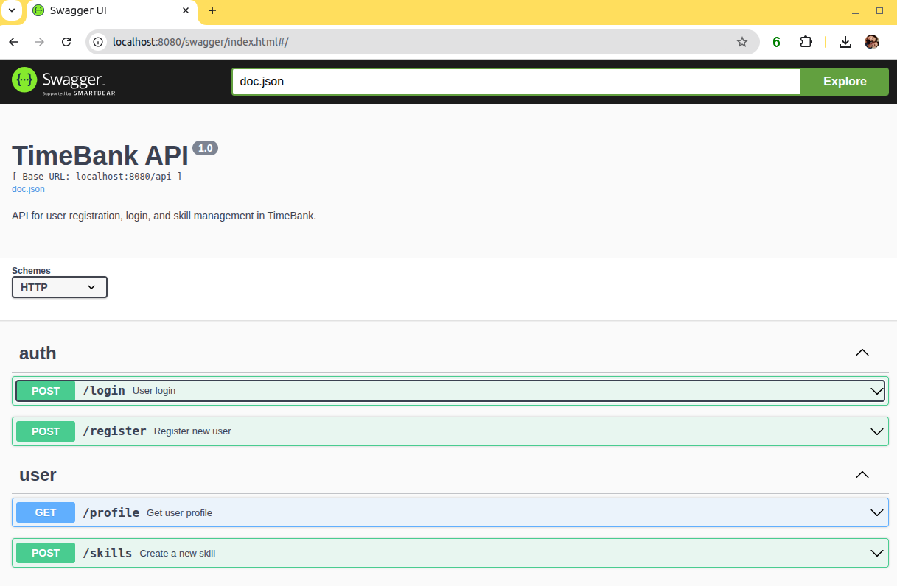

# timebank_backend
Time Bank project backend

## Running the project

```shell
docker compose up -d
```

## Swagger API Documentation
To access the API documentation you just need to run the project and access the swagger endpoind:

```
http://localhost:8080/swagger/index.html#/
```


